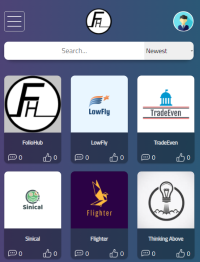
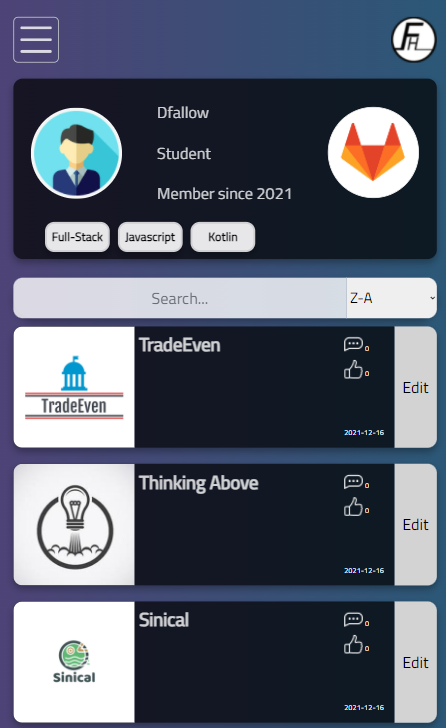
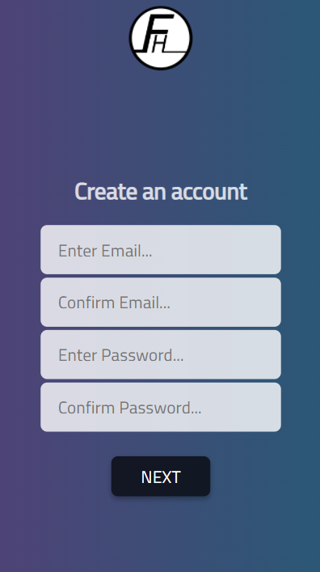
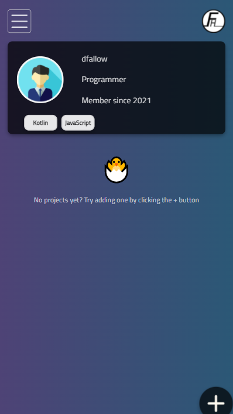

# FolioHub-Front

## What is FolioHub?

FolioHub is a project sharing platform for developers where you can:

- Share and display information about your project, including images and videos

- Make your projects public or private 

- Discover other users profiles and the projects that they have created

- Give comments and ratings to public projects that are displayed in the app

## The Purpose

FolioHub is intented to be a platform that is benificial for job recruitment. Its premise is to create a visual application that is easy for\
developers to display all of the projects they have worked on, and for recruiters to be able to find, discover and view projects and how\
they have been recieved (likes/comments).

## Images

## Getting Started

 

Once you have logged in click the profile icon to navigate to the login page\
From there you can create your own account. 

Once setup you'll be on your way to uploading your first project, use the side\
menu or the plus button in your profile to start. Don't forget to view other\
people's projects whilst your here.

## The Creators

For help and advice related to this project, don't hhesitate to contact its\
creators with the subject FolioHub.

| Name | Email |
| ---  | ---   |
| David Fallow | davidfa@metropolia.fi |
| Sam Hämäläinen | sam.hamalainen@metropolia.fi | 
| Soulyvanh Phetsarath | soulyvanh.phetsarath@metropolia.fi |

## Useful Links

- [Figma Mockup](https://www.figma.com/file/mdyjhmZnkIZ526PjswwnYA/FolioHub)
- [Planner](https://tasks.office.com/metropoliafi.onmicrosoft.com/en/Home/Planner#/plantaskboard?groupId=01441a25-4b80-40f9-8634-8448a29a6cff&planId=LBA_Q0Gq0U-cad4kYhqC7ZYAGWZp)

